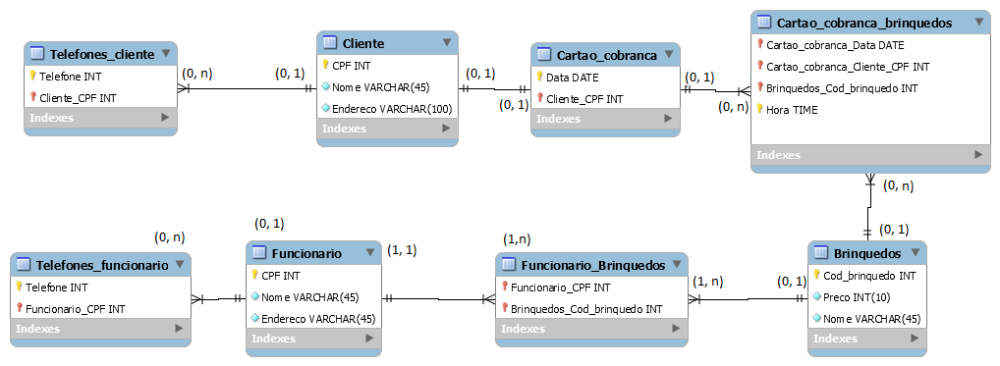

# Trabalho da disciplina banco de dados I - UERJ 2019/2

## Integrantes

* Dennis Ribeiro Paiva - 201610050611
* Paulo Victor Coelho - 201610049711
* Vinicius Sathler - 201610051611
  
## Introdução

Neste trabalho serão apresentados todos os passos de modelagem de um projeto básico de banco de dados, da descrição do minimundo até sua implementação funcional.
O tema abordado será o gerenciamento do cartão de visita de um visitante em um parque de diversões.

## Minimundo

O parque de diversões 'SmashLand' é um parque moderno mas muito ganancioso. Seus visitantes recebem na entrada um cartão digital que deve ser apresentado na entrada de cada brinquedo. Cada brinquedo possui um nome e código de identificação. Sendo a gerência do parque muito gananciosa, cada cartão de visitante deve registrar a cobrança de entrada nos brinquedos cada vez que for utilizado, ou seja, o visitante paga cada vez que for usar um brinquedo. Os funcionários deste parque também são muito ocupados, tendo muitas vezes que trabalhar em mais de um brinquedo, sendo que cada brinquedo pode precisar de um ou mais funcionários. Para estimular uma concorrência saudável entre seus funcionários, a gerência do parque paga um adicional de dois por cento do dinheiro arrecadado em cada brinquedo para cada funcionario responsável por ele. A fim de evitar fraudes, tanto os clientes quanto os funcionários devem ser registrados de acordo com o seu nome completo, CPF, endereço e telefone(s) para contato. Para disfarçar sua ganância o parque permite que cada cartão sejá válido por um dia inteiro. Ao final do dia o visitante deve pagar o valor acumulado de todos os brinquedos que visitou.

## Modelo conceitual

### Diagrama entidade-relacionamento

</img>

### Restrições de Domínio

<ul>
    <li>Visitante:<ul><li>CPF: Número inteiro de onze dígitos.</li><li>Nome: String de no máximo 40 caracteres.</li><li>Endereço: String de no máximo 80 caracteres.</li><li>Telefone: Numero inteiro formado por oito ou nove dígitos.</li>
    </ul>
    </li>
    <li>Cartão:<ul><li>Data: Data no formato aaaa-mm-dd de acordo com o tipo DATE da linguagem mySQL.</li></ul></li>
    <li>Brinquedo:<ul><li>Cod_brinquedo: Numero inteiro de cinco dígitos.</li><li>Nome: String de no máximo 40 caracteres.</li><li>Preço: Número real positivo com duas casas decimais de precisão.</li></ul></li>
    <li>Registra (Cartão-Brinquedo):<ul><li> Hora: registro de hora no formato hh-mm-ss de acordo com o tipo TIME da linguagem mySQL.</li></ul></li>
    <li>Funcionário:<ul><li>CPF: Número inteiro de onze dígitos.</li><li>Nome: String de no máximo 40 caracteres.</li><li>Endereço: String de no máximo 80 caracteres.</li><li>Telefone: Numero inteiro formado por oito ou nove dígitos.</li>
</ul></ul>


## Modelo Relacional

### Descrição

* **Chave primária**<br/>
* _Chave estrangeira_
<br><br><br>
* Cliente (**CPF**, Nome, Endereço)
* Telefones_cliente (**Telefone**, **_Cliente_CPF_**)
* Cartao_Cobrança (**Data**, _**Cliente_CPF**_)
* Brinquedo (**Cod_brinquedo**, Nome, Preço)
* Cartao_cobranca_brinquedo (**Hora**, _**Cartao_Cobrança_Data**_, _**Cartao_Cobranca_Cliente_CPF**_, _**Brinquedo_Cod_brinquedo**_)
* Funcionario (**CPF**, Nome, Endereço)
* Telefones_funcionario (**Telefone**, **_Funcionario_CPF_**)
* Funcionario_brinquedo (_**Funcionario_CPF**_, _**Brinquedo_Cod_brinquedo**_)
  
<p>
    Sabendo-se que cada Cliente possui nenhum ou vários cartões, mas que cada cartão está vinculado a obrigatoriamente um e apenas um cliente, foi adicionada uma coluna extra na tabela cartão para referenciar o cliente ao qual ele está asssociado
</p>
<p>
    Como cada cartão de cobrança pode registrar nenhum ou vários brinquedos, e cada brinquedo pode estar registrado em nenhum ou vários cartões, criou-se uma nova tabela para relação
</p>
<p>
    Cada funcionário pode trabalhar em nenhum ou mais de um brinquedo, e cada brinquedo possui entre um e varios funcionários. De maneira análoga a relação brinquedo-cartão foi criada uma nova tabela
</p>

### Diagrama

</img>

### Restrições Semânticas
<ol>
    <li>
        Cada funcionário não pode receber menos do que o salário minímo, estipulado em $sc 500,00 
    </li>
    <li>
        O visitante paga por cada brinquedo visitado, mas não pode pagar menos de $sc 100,00
    </li>
</ol>

## Algebra Relacional

### Cobrança do visitante Paulo Coelho no dia 01 de Junho de 2019
</img>

### Calculo do salário do funcionário Dennis Ribeiro no mês de junho
</img>

### Clientes que visitaram todos os brinquedos em qualquer intervalo de tempo
</img>

### Funcionários que visitaram os brinquedos em que trabalham como clientes
</img>

## Consultas em SQL

## Script DDL

```sql
create database bd1;

use bd1;

CREATE TABLE Cliente (
  CPF INT NOT NULL PRIMARY KEY,
  Nome VARCHAR(45) NOT NULL,
  Endereco VARCHAR(100) NOT NULL
);

CREATE TABLE Brinquedos (
  Cod_brinquedo INT NOT NULL PRIMARY KEY,
  Preco INT(10) NOT NULL,
  Nome VARCHAR(45) NOT NULL
);

CREATE TABLE Funcionario (
  CPF INT NOT NULL PRIMARY KEY,
  Nome VARCHAR(45) NOT NULL,
  Endereco VARCHAR(45) NOT NULL
);

CREATE TABLE Funcionario_Brinquedos (
  Funcionario_CPF INT NOT NULL,
  Brinquedos_Cod_brinquedo INT NOT NULL,
  CONSTRAINT pk_Funcionario_Brinquedos PRIMARY KEY (Funcionario_CPF, Brinquedos_Cod_brinquedo),
  CONSTRAINT fk_Funcionario_CPF FOREIGN KEY (Funcionario_CPF) REFERENCES Funcionario(CPF),
  CONSTRAINT fk_Brinquedos_Cod_brinquedo_funcionarios  FOREIGN KEY (Brinquedos_Cod_brinquedo) REFERENCES Brinquedos(Cod_brinquedo)
);

CREATE TABLE Cartao_cobranca (
  Data DATE NOT NULL,
  Cliente_CPF INT NOT NULL,
  CONSTRAINT pk_Cartao_cobranca PRIMARY KEY (Data, Cliente_CPF),
  CONSTRAINT fk_Cliente_CPF FOREIGN KEY (Cliente_CPF) REFERENCES Cliente(CPF)
);

CREATE TABLE Cartao_cobranca_brinquedos (
  Cartao_cobranca_Data DATE NOT NULL,
  Cartao_cobranca_Cliente_CPF INT NOT NULL,
  Brinquedos_Cod_brinquedo INT NOT NULL,
  Hora TIME NOT NULL,
  CONSTRAINT pk_Cartao_cobranca_brinquedos PRIMARY KEY (Cartao_cobranca_Data, Cartao_cobranca_Cliente_CPF, Brinquedos_Cod_brinquedo, Hora),
  CONSTRAINT fk_Cartao_cobranca_Data FOREIGN KEY (Cartao_cobranca_Data)  REFERENCES Cartao_cobranca(Data),
  CONSTRAINT fk_Cartao_cobranca_Cliente_CPF FOREIGN KEY (Cartao_cobranca_Cliente_CPF) REFERENCES Cartao_cobranca(Cliente_CPF),
  CONSTRAINT fk_Brinquedos_Cod_brinquedo_cartao_cobranca FOREIGN KEY (Brinquedos_Cod_brinquedo) REFERENCES Brinquedos(Cod_brinquedo)
);

CREATE TABLE Telefones_funcionario (
  Telefone INT NOT NULL,
  Funcionario_CPF INT NOT NULL,
  CONSTRAINT pk_Telefones_funcionario PRIMARY KEY (Telefone, Funcionario_CPF),
  CONSTRAINT fk_Funcionario_CPF_tel FOREIGN KEY (Funcionario_CPF) REFERENCES Funcionario(CPF)
);

CREATE TABLE Telefones_cliente (
  Telefone INT NOT NULL,
  Cliente_CPF INT NOT NULL,
  CONSTRAINT pk_Telefones_cliente PRIMARY KEY (Telefone, Cliente_CPF),
  CONSTRAINT fk_cliente_cpf_tel FOREIGN KEY (Cliente_CPF) REFERENCES Cliente(CPF)
);
```


